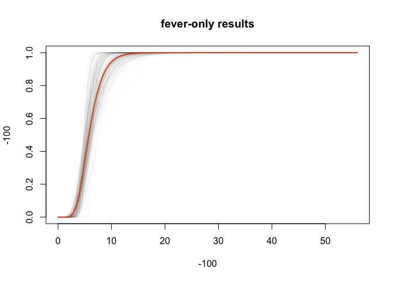
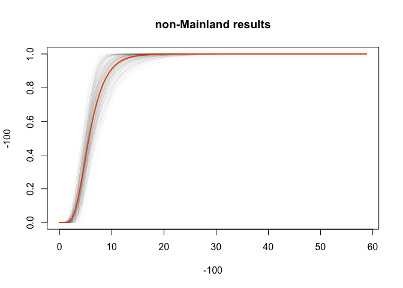
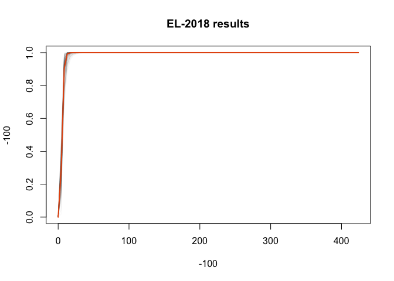

Real-time estimation of the Wuhan coronavirus incubation time
=============================================================

Updated: Tue Jan 28 20:05:35 2020

The our lab has been collecting data on the exposure and symptom onset
for Wuhan novel coronavirus (nCoV-2019) cases that have been confirmed
outside of the Hubei province. These cases have been confirmed either in
other countries or in regions of China with no known local transmission.
We search for news articles and reports in both English and Chinese and
abstract the data necessary to estimate the incubation period of
nCoV-2019. Two authors independently review the full text of each case
report to ensure that data is correctly input. Discrepancies are
resolved by discussion and consensus.

Data summary
------------

There are 101 cases that have been double-checked by our team. Of those
34 are known to be female (34%) and 63 are male (62%). The median age is
about 51.5 years (IQR: 36.25-57.5). 30 cases are from Mainland China
(30%), while 71 are from the rest of the world (70%). 61 cases presented
with a fever (60%).

Exposure and symptom onset windows
----------------------------------

The necessary components for estimating the incubation period are left
and right bounds for the exposure (EL and ER) and symptom onset times
(SE and SR) for each case. We use explicit dates and times when they are
reported in the source documents, however when they are not available,
we make the following assumptions:

-   For cases without a reported right-bound on symptom onset time (SR),
    we use the time that the case is first presented to a hospital or,
    lacking that, the time that the source document was published
-   For cases without an EL, we use 2019 December 1, which was the onset
    date for the first reported nCoV-2019 case; though we will test this
    assumption later
-   For cases without an ER, we use the SR
-   For cases without an SL, we use the EL

Under these assumptions, the median exposure interval was 49 (range:
1-58.8) and the median symptom onset interval was 1 (range: 0-58.8).

This figure displays the exposure and symptom onset windows for each
case in our dataset, relative to the right-bound of the exposure window
(ER). The blue bars indicate the the exposure windows and the red bars
indicate the symptom onset windows for each case. Purple areas are where
those two bars overlap.

Incubation period estimates
---------------------------

We estimate the incubation period using the package based on the paper
by Reich *et al*, 2009, using code originally written for determining
the incubation period of Zika virus (Lessler *et al*, 2016). Basic
incubation period analysis assuming a log-normal incubation period and
using a bootstrap method for calculating confidence intervals.

The first model we fit is to all of the data and output the median,
2.5th, and 97.5th quantiles (and their confidence intervals):

<table>
<thead>
<tr class="header">
<th></th>
<th style="text-align: right;">est</th>
<th style="text-align: right;">CIlow</th>
<th style="text-align: right;">CIhigh</th>
</tr>
</thead>
<tbody>
<tr class="odd">
<td>p2.5</td>
<td style="text-align: right;">2.542</td>
<td style="text-align: right;">1.829</td>
<td style="text-align: right;">3.564</td>
</tr>
<tr class="even">
<td>p5</td>
<td style="text-align: right;">2.850</td>
<td style="text-align: right;">2.153</td>
<td style="text-align: right;">3.849</td>
</tr>
<tr class="odd">
<td>p25</td>
<td style="text-align: right;">4.052</td>
<td style="text-align: right;">3.411</td>
<td style="text-align: right;">4.859</td>
</tr>
<tr class="even">
<td>p50</td>
<td style="text-align: right;">5.174</td>
<td style="text-align: right;">4.460</td>
<td style="text-align: right;">6.037</td>
</tr>
<tr class="odd">
<td>p75</td>
<td style="text-align: right;">6.608</td>
<td style="text-align: right;">5.474</td>
<td style="text-align: right;">8.062</td>
</tr>
<tr class="even">
<td>p95</td>
<td style="text-align: right;">9.394</td>
<td style="text-align: right;">6.887</td>
<td style="text-align: right;">12.844</td>
</tr>
<tr class="odd">
<td>p97.5</td>
<td style="text-align: right;">10.531</td>
<td style="text-align: right;">7.381</td>
<td style="text-align: right;">15.051</td>
</tr>
</tbody>
</table>

The median incubation period lasts 5.174 days (CI: 4.46-6.037). The
fastest incubation periods pass in 2.542 days (CI: 1.829-3.564), while
the longest ones take 10.531 days (CI: 7.381-15.051).

Alternate estimates and sensitivity analyses
--------------------------------------------

To make sure that our overall incubation estimates are sound, we ran a
few analyses on subsets to see if the results held up. Since the winter
often brings cold air and other pathogens that can cause sore throats
and coughs, we ran an analysis using only cases that reported a fever.
Since a plurality of our cases came from Mainland China, where
assumptions about local transmission may be less firm, we ran an
analysis without those cases. Finally, we challenge our assumption that
unknown ELs can be assumed to be 2019 December 1 (Nextstrain estimates
that it could have happened as early as September), by setting unknown
ELs to 2018 December 1.

    ## Warning in dic.fit(ncov_fever_dic, dist = "L", n.boots = 1000, ptiles = c(0.025, : Could not estimate the MLEs for 20 of 1000 bootstrap replications. Excluding these from the calculation of confidence intervals and standard errors so interpret with caution.

<table>
<thead>
<tr class="header">
<th></th>
<th style="text-align: right;">est</th>
<th style="text-align: right;">CIlow</th>
<th style="text-align: right;">CIhigh</th>
<th style="text-align: right;">diff</th>
</tr>
</thead>
<tbody>
<tr class="odd">
<td>p2.5</td>
<td style="text-align: right;">2.919</td>
<td style="text-align: right;">2.238</td>
<td style="text-align: right;">4.772</td>
<td style="text-align: right;">0.377</td>
</tr>
<tr class="even">
<td>p5</td>
<td style="text-align: right;">3.257</td>
<td style="text-align: right;">2.593</td>
<td style="text-align: right;">4.981</td>
<td style="text-align: right;">0.407</td>
</tr>
<tr class="odd">
<td>p25</td>
<td style="text-align: right;">4.561</td>
<td style="text-align: right;">3.902</td>
<td style="text-align: right;">5.863</td>
<td style="text-align: right;">0.509</td>
</tr>
<tr class="even">
<td>p50</td>
<td style="text-align: right;">5.765</td>
<td style="text-align: right;">4.769</td>
<td style="text-align: right;">7.291</td>
<td style="text-align: right;">0.591</td>
</tr>
<tr class="odd">
<td>p75</td>
<td style="text-align: right;">7.286</td>
<td style="text-align: right;">5.388</td>
<td style="text-align: right;">9.559</td>
<td style="text-align: right;">0.678</td>
</tr>
<tr class="even">
<td>p95</td>
<td style="text-align: right;">10.205</td>
<td style="text-align: right;">6.109</td>
<td style="text-align: right;">15.285</td>
<td style="text-align: right;">0.811</td>
</tr>
<tr class="odd">
<td>p97.5</td>
<td style="text-align: right;">11.385</td>
<td style="text-align: right;">6.383</td>
<td style="text-align: right;">17.998</td>
<td style="text-align: right;">0.854</td>
</tr>
</tbody>
</table>

Using only fevers, the estimates are 0.377 to 0.854 days longer than the
estimates on the full data. 8 of the cases with a fever reported having
other symptoms beforehand. While it may take a little longer for an
exposure to cause a fever, the estimates are similar to those of the
overall results. The confidence intervals are wider here at every
quantile due to having less data.

    ## Warning in dic.fit(ncov_foreign_dic, dist = "L", n.boots = 1000, ptiles = c(0.025, : Could not estimate the MLEs for 1 of 1000 bootstrap replications. Excluding these from the calculation of confidence intervals and standard errors so interpret with caution.

<table>
<thead>
<tr class="header">
<th></th>
<th style="text-align: right;">est</th>
<th style="text-align: right;">CIlow</th>
<th style="text-align: right;">CIhigh</th>
<th style="text-align: right;">diff</th>
</tr>
</thead>
<tbody>
<tr class="odd">
<td>p2.5</td>
<td style="text-align: right;">2.451</td>
<td style="text-align: right;">1.671</td>
<td style="text-align: right;">3.886</td>
<td style="text-align: right;">-0.091</td>
</tr>
<tr class="even">
<td>p5</td>
<td style="text-align: right;">2.803</td>
<td style="text-align: right;">2.006</td>
<td style="text-align: right;">4.146</td>
<td style="text-align: right;">-0.047</td>
</tr>
<tr class="odd">
<td>p25</td>
<td style="text-align: right;">4.235</td>
<td style="text-align: right;">3.394</td>
<td style="text-align: right;">5.394</td>
<td style="text-align: right;">0.183</td>
</tr>
<tr class="even">
<td>p50</td>
<td style="text-align: right;">5.643</td>
<td style="text-align: right;">4.487</td>
<td style="text-align: right;">7.045</td>
<td style="text-align: right;">0.469</td>
</tr>
<tr class="odd">
<td>p75</td>
<td style="text-align: right;">7.519</td>
<td style="text-align: right;">5.525</td>
<td style="text-align: right;">9.712</td>
<td style="text-align: right;">0.911</td>
</tr>
<tr class="even">
<td>p95</td>
<td style="text-align: right;">11.362</td>
<td style="text-align: right;">7.132</td>
<td style="text-align: right;">16.081</td>
<td style="text-align: right;">1.968</td>
</tr>
<tr class="odd">
<td>p97.5</td>
<td style="text-align: right;">12.992</td>
<td style="text-align: right;">7.600</td>
<td style="text-align: right;">19.167</td>
<td style="text-align: right;">2.461</td>
</tr>
</tbody>
</table>

Using only cases from outside of Mainland China, the estimates are
-0.091 to 2.461 days longer than the estimates on the full data. There
is a bit of a gap on the long end of the tail, but the confidence
intervals overlap for the most part.

<table>
<thead>
<tr class="header">
<th></th>
<th style="text-align: right;">est</th>
<th style="text-align: right;">CIlow</th>
<th style="text-align: right;">CIhigh</th>
<th style="text-align: right;">diff</th>
</tr>
</thead>
<tbody>
<tr class="odd">
<td>p2.5</td>
<td style="text-align: right;">2.540</td>
<td style="text-align: right;">1.795</td>
<td style="text-align: right;">3.499</td>
<td style="text-align: right;">-0.002</td>
</tr>
<tr class="even">
<td>p5</td>
<td style="text-align: right;">2.855</td>
<td style="text-align: right;">2.116</td>
<td style="text-align: right;">3.745</td>
<td style="text-align: right;">0.005</td>
</tr>
<tr class="odd">
<td>p25</td>
<td style="text-align: right;">4.094</td>
<td style="text-align: right;">3.459</td>
<td style="text-align: right;">4.927</td>
<td style="text-align: right;">0.042</td>
</tr>
<tr class="even">
<td>p50</td>
<td style="text-align: right;">5.260</td>
<td style="text-align: right;">4.509</td>
<td style="text-align: right;">6.282</td>
<td style="text-align: right;">0.086</td>
</tr>
<tr class="odd">
<td>p75</td>
<td style="text-align: right;">6.759</td>
<td style="text-align: right;">5.441</td>
<td style="text-align: right;">8.631</td>
<td style="text-align: right;">0.151</td>
</tr>
<tr class="even">
<td>p95</td>
<td style="text-align: right;">9.693</td>
<td style="text-align: right;">6.875</td>
<td style="text-align: right;">14.368</td>
<td style="text-align: right;">0.299</td>
</tr>
<tr class="odd">
<td>p97.5</td>
<td style="text-align: right;">10.897</td>
<td style="text-align: right;">7.362</td>
<td style="text-align: right;">16.988</td>
<td style="text-align: right;">0.366</td>
</tr>
</tbody>
</table>

When we set the unknown ELs to 2018 December 1 instead of 2019 December
1, the estimates are -0.002 to 0.366 days longer than the estimates on
the full data. Somewhat surprisingly, this changes the estimates less
than either of the other alternate estimates.

