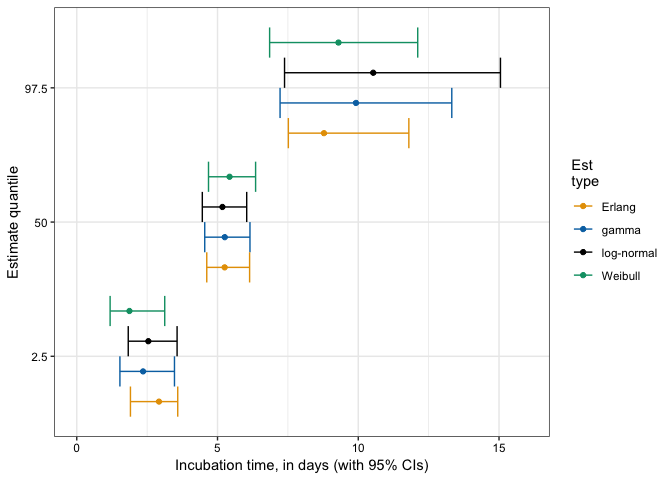
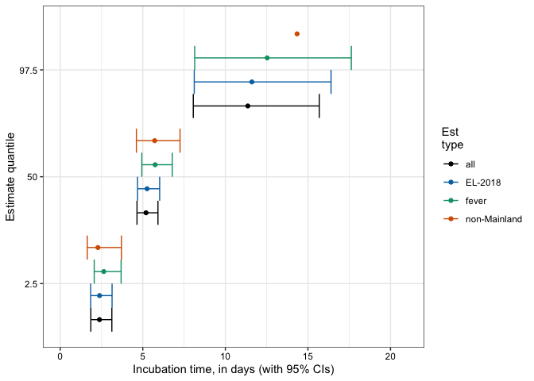
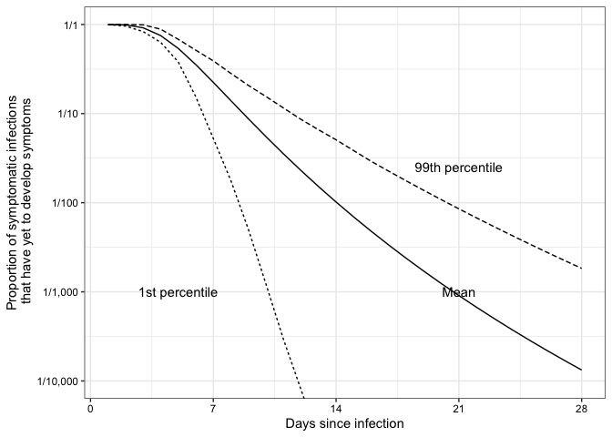
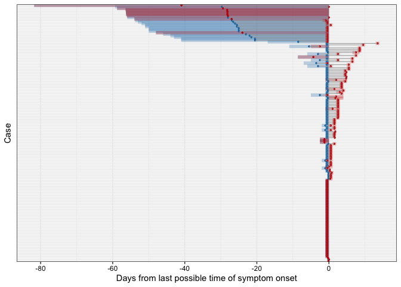
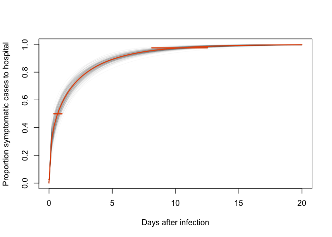

Real-time estimation of the novel coronavirus incubation time
=============================================================

Updated: Tue Feb 11 11:59:19 2020

[Read the medRxiv
preprint!](https://www.medrxiv.org/content/10.1101/2020.02.02.20020016v1)

Our lab has been collecting data (freely available at
[`data/nCoV-IDD-traveler-data.csv`](https://github.com/HopkinsIDD/ncov_incubation/blob/master/data/nCoV-IDD-traveler-data.csv))
on the exposure and symptom onset for novel coronavirus (nCoV-2019)
cases that have been confirmed outside of the Hubei province. These
cases have been confirmed either in other countries or in regions of
China with no known local transmission. We search for news articles and
reports in both English and Chinese and abstract the data necessary to
estimate the incubation period of nCoV-2019. Two team members
independently review the full text of each case report to ensure that
data is correctly input. Discrepancies are resolved by discussion and
consensus.

Quick links:

-   [Data summary](#data-summary)
-   [Exposure and symptom onset
    windows](#exposure-and-symptom-onset-windows)
-   [Incubation period estimates](#incubation-period-estimates)
-   [Alternate estimates and sensitivity
    analyses](#alternate-estimates-and-sensitivity-analyses)
-   [Comparison to other estimates](#comparison-to-other-estimates)
-   [Parameter estimates](#parameter-estimates)
-   [Active monitoring analysis](#active-monitoring-analysis)
-   [Time to hospitalization](#time-to-hospitalization)

Data summary
------------

There are 101 cases from 38 countries and provinces outside of Hubei,
China. Of those 34 are known to be female (34%) and 63 are male (62%).
The median age is about 52 years (IQR: 36.5-59). 29 cases are from
Mainland China (29%), while 72 are from the rest of the world (71%). 61
cases presented with a fever (60%).

This figure displays the exposure and symptom onset windows for each
case in our dataset, relative to the right-bound of the exposure window
(ER). The blue bars indicate the the exposure windows and the red bars
indicate the symptom onset windows for each case. Purple areas are where
those two bars overlap.

The bars where the exposure and symptom onset windows completely overlap
are frequently travelers from Wuhan who were symptomatic on arrival to
another country, that did not release further details. These cases could
have been exposed or symptomatic at any point prior to their trip

Exposure and symptom onset windows
----------------------------------

The necessary components for estimating the incubation period are left
and right bounds for the exposure (EL and ER) and symptom onset times
(SE and SR) for each case. We use explicit dates and times when they are
reported in the source documents, however when they are not available,
we make the following assumptions:

-   For cases without a reported right-bound on symptom onset time (SR),
    we use the time that the case is first presented to a hospital or,
    lacking that, the time that the source document was published
-   For cases without an EL, we use 2019 December 1, which was the onset
    date for the first reported nCoV-2019 case; though we will test this
    assumption later
-   For cases without an ER, we use the SR
-   For cases without an SL, we use the EL

Under these assumptions, the median exposure interval was 49 (range:
1-58.8) and the median symptom onset interval was 1 (range: 0-58.8).

Incubation period estimates
---------------------------

We estimate the incubation period using the coarseDataTools package
based on the paper by [Reich *et al*,
2009](https://onlinelibrary.wiley.com/doi/pdf/10.1002/sim.3659). We
assume a log-normal incubation period and using a bootstrap method for
calculating confidence intervals.

The first model we fit is to all of the data and output the median,
2.5th, and 97.5th quantiles (and their confidence intervals):

<table>
<thead>
<tr class="header">
<th></th>
<th style="text-align: right;">est</th>
<th style="text-align: right;">CIlow</th>
<th style="text-align: right;">CIhigh</th>
</tr>
</thead>
<tbody>
<tr class="odd">
<td>meanlog</td>
<td style="text-align: right;">1.644</td>
<td style="text-align: right;">1.495</td>
<td style="text-align: right;">1.798</td>
</tr>
<tr class="even">
<td>sdlog</td>
<td style="text-align: right;">0.363</td>
<td style="text-align: right;">0.201</td>
<td style="text-align: right;">0.521</td>
</tr>
<tr class="odd">
<td>p2.5</td>
<td style="text-align: right;">2.542</td>
<td style="text-align: right;">1.829</td>
<td style="text-align: right;">3.564</td>
</tr>
<tr class="even">
<td>p5</td>
<td style="text-align: right;">2.850</td>
<td style="text-align: right;">2.153</td>
<td style="text-align: right;">3.849</td>
</tr>
<tr class="odd">
<td>p25</td>
<td style="text-align: right;">4.052</td>
<td style="text-align: right;">3.411</td>
<td style="text-align: right;">4.859</td>
</tr>
<tr class="even">
<td>p50</td>
<td style="text-align: right;">5.174</td>
<td style="text-align: right;">4.460</td>
<td style="text-align: right;">6.037</td>
</tr>
<tr class="odd">
<td>p75</td>
<td style="text-align: right;">6.608</td>
<td style="text-align: right;">5.474</td>
<td style="text-align: right;">8.062</td>
</tr>
<tr class="even">
<td>p95</td>
<td style="text-align: right;">9.394</td>
<td style="text-align: right;">6.887</td>
<td style="text-align: right;">12.844</td>
</tr>
<tr class="odd">
<td>p97.5</td>
<td style="text-align: right;">10.531</td>
<td style="text-align: right;">7.381</td>
<td style="text-align: right;">15.051</td>
</tr>
</tbody>
</table>

The median incubation period lasts 5.174 days (CI: 4.46-6.037). The 2.5%
of incubation periods pass in less than 2.542 days (CI: 1.829-3.564),
while 97.5% of the population would experience symptoms by 10.531 days
(CI: 7.381-15.051) since their exposure. The ‘meanlog’ and ‘sdlog’
estimates are the median and dispersion parameters for a LogNormal
distribution; i.e. we recommend using a LogNormal(1.644, 0.363)
distribution to appropriately represent the incubation time
distribution.

Alternate estimates and sensitivity analyses
--------------------------------------------

### Alternate parameterizations

We fit other commonly-used parameterizations of the incubation period as
comparisons to the log-normal distribution: gamma, Weibull, and Erlang.

The median estimates are very similar across parameterizations, while
the Weibull distribution has a slightly smaller value at the 2.5th
percentile and the log-normal distribution has a slightly larger value
at the 97.5th percentile. The log-likelihoods were very similar between
distributions; the log-normal distribution having the largest
log-likelihood (62.05) and the Erlang distribution having the smallest
log-likelihood (60.96).

The gamma distribution has an estimated shape parameter of 7.92 (95% CI:
3.97-24.98) and a scale parameter of 0.69 (95% CI: 0.21-1.52). The
Weibull distribution has an estimated shape parameter of 3.11 (95% CI:
2.2-6.08) and a scale parameter of 6.11 (95% CI: 5.19-7.25). The Erlang
distribution has an estimated shape parameter of 14 (95% CI: 5-21) and a
scale parameter of 0.4 (95% CI: 0.26-1.11).

### Sensitivity analyses

To make sure that our overall incubation estimates are sound, we ran a
few analyses on subsets to see if the results held up. Since the winter
often brings cold air and other pathogens that can cause sore throats
and coughs, we ran an analysis using only cases that reported a fever.
Since a plurality of our cases came from Mainland China, where
assumptions about local transmission may be less firm, we ran an
analysis without those cases. Finally, we challenge our assumption that
unknown ELs can be assumed to be 2019 December 1 ([Nextstrain estimates
that it could have happened as early as
September](https://nextstrain.org/ncov?dmax=2019-12-04&m=num_date)), by
setting unknown ELs to 2018 December 1.

Using only fevers, the estimates are 0.377 to 0.854 days longer than the
estimates on the full data. 8 of the cases with a fever reported having
other symptoms beforehand. While it may take a little longer for an
exposure to cause a fever, the estimates are similar to those of the
overall results. The confidence intervals are wider here at every
quantile due to having less data.

Using only cases from outside of Mainland China, the estimates are
-0.078 to 1.92 days longer than the estimates on the full data. There is
a bit of a gap on the long end of the tail, but the confidence intervals
overlap for the most part.

When we set the unknown ELs to 2018 December 1 instead of 2019 December
1, the estimates are -0.002 to 0.366 days longer than the estimates on
the full data. Somewhat surprisingly, this changes the estimates less
than either of the other alternate estimates.

Comparison to other estimates
-----------------------------

[Backer, Klinkenberg, &
Wallinga](https://www.medrxiv.org/content/10.1101/2020.01.27.20018986v1.full.pdf+html)
estimated the incubation period based on 88 early nCoV cases that
traveled from Wuhan to other regions in China. [Li *et
al*](https://www.nejm.org/doi/full/10.1056/NEJMoa2001316) estimated the
incubation period based on the 10 laboratory-confirmed cases in Wuhan. A
comparison of our incubation periods are shown below:

The median estimates from all models lie between 4.14 and 6.38. The
lower and upper tails for our distributions are all closer to the median
than from the other studies, whether this is due to differences in data
or in estimation methodologies is open for investigation.

Parameter estimates
-------------------

For the convenience of researchers who need parameter estimates for
making infectious disease models, we include a table of the parameter
estimates from our analysis and inferred from the other analyses. The
parameters are different for each distribution; par1 and par2 are
log-mean and log-sd of the log-normal distribution, while they are the
shape and scale parameters for the gamma, Weibull, and Erlang
distributions.

<table>
<thead>
<tr class="header">
<th style="text-align: left;">study</th>
<th style="text-align: center;">type</th>
<th style="text-align: right;">obs</th>
<th style="text-align: right;">par1</th>
<th style="text-align: right;">par2</th>
</tr>
</thead>
<tbody>
<tr class="odd">
<td style="text-align: left;">JHU-IDD</td>
<td style="text-align: center;">log-normal</td>
<td style="text-align: right;">101</td>
<td style="text-align: right;">1.64</td>
<td style="text-align: right;">0.36</td>
</tr>
<tr class="even">
<td style="text-align: left;">JHU-IDD</td>
<td style="text-align: center;">gamma</td>
<td style="text-align: right;">101</td>
<td style="text-align: right;">7.92</td>
<td style="text-align: right;">0.69</td>
</tr>
<tr class="odd">
<td style="text-align: left;">JHU-IDD</td>
<td style="text-align: center;">Weibull</td>
<td style="text-align: right;">101</td>
<td style="text-align: right;">3.11</td>
<td style="text-align: right;">6.11</td>
</tr>
<tr class="even">
<td style="text-align: left;">JHU-IDD</td>
<td style="text-align: center;">Erlang</td>
<td style="text-align: right;">101</td>
<td style="text-align: right;">14.00</td>
<td style="text-align: right;">0.40</td>
</tr>
<tr class="odd">
<td style="text-align: left;">Backer 2020</td>
<td style="text-align: center;">Weibull</td>
<td style="text-align: right;">88</td>
<td style="text-align: right;">3.04</td>
<td style="text-align: right;">7.20</td>
</tr>
<tr class="even">
<td style="text-align: left;">Backer 2020</td>
<td style="text-align: center;">gamma</td>
<td style="text-align: right;">88</td>
<td style="text-align: right;">6.10</td>
<td style="text-align: right;">1.06</td>
</tr>
<tr class="odd">
<td style="text-align: left;">Backer 2020</td>
<td style="text-align: center;">log-normal</td>
<td style="text-align: right;">88</td>
<td style="text-align: right;">1.80</td>
<td style="text-align: right;">0.48</td>
</tr>
<tr class="even">
<td style="text-align: left;">Li 2020</td>
<td style="text-align: center;">log-normal</td>
<td style="text-align: right;">10</td>
<td style="text-align: right;">1.42</td>
<td style="text-align: right;">0.67</td>
</tr>
</tbody>
</table>

Active monitoring analysis
--------------------------

Given these estimates of the incubation period, we predicted the number
of symptomatic infections we would expect to miss over the course of an
active monitoring program. We looked at active monitoring durations from
1 to 28 days for groups of ‘low risk’ (1/10,000 chance of symptomatic
infection), ‘medium risk’ (1/1,000), ‘high risk’ (1/100), and ‘infected’
(1/1), similar to the analysis in [Reich *et al*
(2018)](https://www.nature.com/articles/s41598-018-19406-x).

<table>
<caption>Mean estimated symptomatic infections missed per 10,000 monitored (99th percentile), by duration of monitoring and level of risk</caption>
<thead>
<tr class="header">
<th style="text-align: left;">Monitoring duration</th>
<th style="text-align: left;">Low (1 in 10,000)</th>
<th style="text-align: left;">Medium (1 in 1,000)</th>
<th style="text-align: left;">High (1 in 100)</th>
<th style="text-align: left;">Infected (1 in 1)</th>
</tr>
</thead>
<tbody>
<tr class="odd">
<td style="text-align: left;">7 days</td>
<td style="text-align: left;">0.2 (0.4)</td>
<td style="text-align: left;">2.0 (3.9)</td>
<td style="text-align: left;">19.7 (39.4)</td>
<td style="text-align: left;">1971.5 (3940.2)</td>
</tr>
<tr class="even">
<td style="text-align: left;">14 days</td>
<td style="text-align: left;">0.0 (0.0)</td>
<td style="text-align: left;">0.1 (0.4)</td>
<td style="text-align: left;">0.6 (4.5)</td>
<td style="text-align: left;">64.4 (449.6)</td>
</tr>
<tr class="odd">
<td style="text-align: left;">21 days</td>
<td style="text-align: left;">0.0 (0.0)</td>
<td style="text-align: left;">0.0 (0.1)</td>
<td style="text-align: left;">0.1 (0.8)</td>
<td style="text-align: left;">5.3 (75.3)</td>
</tr>
<tr class="even">
<td style="text-align: left;">28 days</td>
<td style="text-align: left;">0.0 (0.0)</td>
<td style="text-align: left;">0.0 (0.0)</td>
<td style="text-align: left;">0.0 (0.2)</td>
<td style="text-align: left;">0.8 (17.0)</td>
</tr>
</tbody>
</table>

Time to hospitalization
-----------------------

We can use the same procedure for estimating the incubation period to
estimate the time from symptom onset to hospitalization.

This figure displays the symptom onset and hospitalization windows for
each case in our dataset, relative to the right-bound of the symptom
onset window (SR). The blue bars indicate the the symptom onset windows
and the red bars indicate the hospitalization windows for each case.
Purple areas are where those two bars overlap.

Of the 93 individuals who developed symptoms in the community (as
opposed to in isolation), 26 (28%) were hospitalized within a day.

We modeled the time to hospitalization as a gamma distribution:

<table>
<thead>
<tr class="header">
<th></th>
<th style="text-align: right;">est</th>
<th style="text-align: right;">CIlow</th>
<th style="text-align: right;">CIhigh</th>
</tr>
</thead>
<tbody>
<tr class="odd">
<td>shape</td>
<td style="text-align: right;">0.444</td>
<td style="text-align: right;">0.290</td>
<td style="text-align: right;">0.691</td>
</tr>
<tr class="even">
<td>scale</td>
<td style="text-align: right;">3.761</td>
<td style="text-align: right;">2.325</td>
<td style="text-align: right;">5.489</td>
</tr>
<tr class="odd">
<td>p2.5</td>
<td style="text-align: right;">0.001</td>
<td style="text-align: right;">0.000</td>
<td style="text-align: right;">0.011</td>
</tr>
<tr class="even">
<td>p25</td>
<td style="text-align: right;">0.129</td>
<td style="text-align: right;">0.027</td>
<td style="text-align: right;">0.344</td>
</tr>
<tr class="odd">
<td>p50</td>
<td style="text-align: right;">0.680</td>
<td style="text-align: right;">0.297</td>
<td style="text-align: right;">1.150</td>
</tr>
<tr class="even">
<td>p75</td>
<td style="text-align: right;">2.163</td>
<td style="text-align: right;">1.384</td>
<td style="text-align: right;">2.922</td>
</tr>
<tr class="odd">
<td>p97.5</td>
<td style="text-align: right;">8.860</td>
<td style="text-align: right;">6.323</td>
<td style="text-align: right;">11.345</td>
</tr>
</tbody>
</table>

The model estimates that time to hospitalization is 1.7 days, on
average. The majority of cases report quickly, though there is a long
tail.
